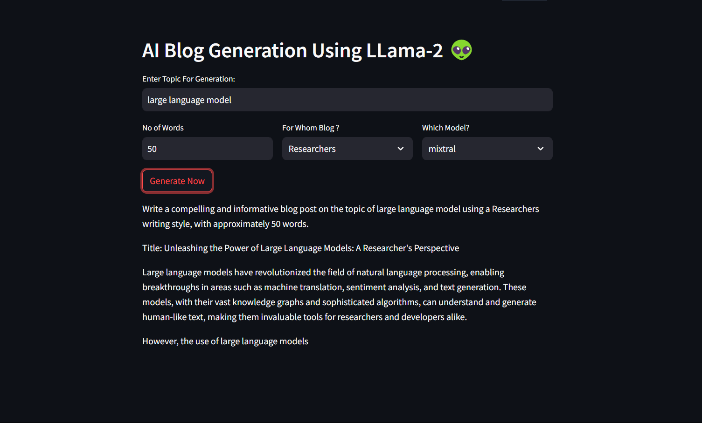

# AI Blog Generator

This project demonstrates an AI-powered blog generator using HuggingFace Model Like Gemma and Mixtral. The code allows users to input a topic, specify the blog style, select the model, and generate a blog post of a specified length. It utilizes Streamlit for the user interface and Hugging Face models for language generation.

## Usage

1. Install the required dependencies by running:
   ```bash
   pip install -r requirements.txt
   ```

2. Run the application by executing `blog_generator.py`:
   ```bash
   python app2.py
   ```

3. Enter a topic, select the blog style and model, and click "Generate Now" to generate a blog post.

## Dependencies

- Streamlit
- Langchain
- HuggingFace Hub

## Screenshots



## Deployed App

You can access the deployed AI Blog Generator application [here](https://huggingface.co/spaces/hellofaz007/blogUsingLangchain).
